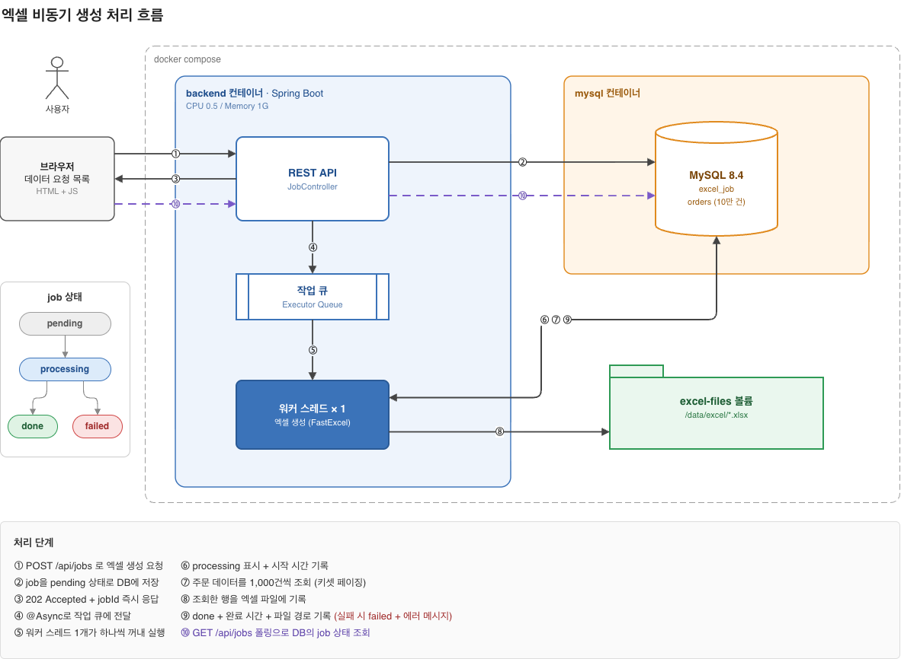

# 대용량 엑셀 비동기 생성 서버

엑셀 생성을 요청하면 즉시 응답하고 주문 데이터 **10만 건**을 **백그라운드에서** 엑셀 파일로 만드는 비동기 처리 서버입니다.
컨테이너 1개, **CPU 0.5코어, 메모리 1GB**라는 고정된 자원 안에서 동작하도록 설계했습니다.

<br>

## 1. 실행 방법

```bash
docker compose up --build
```

- 브라우저에서 **http://localhost:8080** 에 접속하면 '데이터 요청 목록' 화면이 열립니다.
- 처음 실행할 때 DB 테이블 생성과 시드 데이터 10만 건 삽입이 자동으로 진행됩니다.

| 상황 | 명령 |
|---|---|
| DB와 생성된 파일까지 모두 초기화 | `docker compose down -v` 후 `docker compose up --build` |

<br>

## 2. 기술 스택과 선택 이유

| 영역 | 선택 | 이유                                                                                             |
|---|---|------------------------------------------------------------------------------------------------|
| 백엔드 | Spring Boot 4, Java 21 | 스레드 풀, 트랜잭션, 검증 등 비동기 작업 서버에 필요한 기능이 기본으로 갖춰져 있습니다.                                            |
| DB 접근 | `JdbcClient` (JPA 미사용) | 쿼리가 단순한 조회와 `UPDATE`뿐이라 JPA 없이 SQL을 직접 쓰는 쪽이 간단합니다. 10만 건을 읽을 때 영속성 컨텍스트에 엔티티가 쌓이는 부담도 없습니다.   |
| DB | MySQL 8.4 | 재귀 CTE로 시드 10만 건을 SQL 한 번에 넣을 수 있고 공식 이미지의 초기화 스크립트 기능으로 자동 시드가 간단합니다.                         |
| 엑셀 생성 | fastexcel (dhatim) | XML을 파일에 바로 흘려 쓰는 스트리밍 방식이라 메모리가 가장 작고 빠르며 쓰기만 하는 이 서버에는 적은 기능으로도 충분합니다.                       |
| 비동기 처리 | 단일 스레드 `ThreadPoolTaskExecutor` | 엑셀 생성은 CPU를 많이 쓰는 작업이라 0.5 CPU에서는 스레드를 늘려도 처리량이 같습니다. 워커 1개로 단순하게 유지하고 먼저 요청한 job이 먼저 끝나게 했습니다. |
| 프론트엔드 | 순수 HTML + JS | Spring Boot가 정적 파일로 직접 서빙하므로 별도 프론트 컨테이너가 필요 없고 CORS 설정도 필요 없습니다.                              |
| 상태 확인 | 폴링 | job이 수 초 걸려 2초 늦게 알아도 체감 차이가 없고 서버는 기존 조회 API만 있으면 됩니다. 진행 중인 job이 있으면 2초, 없으면 10초 간격으로 조회합니다. |

<br>

## 3. 동작 흐름



- job 상태: `pending` → `processing` → `done` / `failed`
- 생성된 파일 위치: 컨테이너 볼륨 `/data/excel/orders_job_{id}.xlsx`

### API

| 메서드 | 경로 | 설명                                                                                          |
|---|---|---------------------------------------------------------------------------------------------|
| `POST` | `/api/jobs` | 엑셀 생성 요청. job을 만들고 즉시 `202 Accepted`로 응답합니다. 비동기적으로 엑셀 생성을 시작합니다. 진행 중인 job이 10개 이상이면 `429`로 거절합니다.                           |
| `GET` | `/api/jobs?cursor={id}` | job 목록을 최신순으로 15건씩 조회합니다. 응답은 `{ items, nextCursor }`이고, `nextCursor`가 `null`이면 마지막 페이지입니다. |

<br>

## 4. 설계 시 고민한 점

### 고민한 점 1. 1,000건씩 끊어서 조회 vs 스트리밍 조회

**결론: 1,000건씩 끊어 읽는 키셋 페이징**을 택했습니다.

- 0.5 CPU 환경에서 병목은 DB 조회가 아니라 **엑셀 쓰기** 입니다. 그래서 스트리밍 조회로 얻는 속도 이점은 작습니다.
- 반면 스트리밍 조회는 생성이 끝날 때까지 **DB 커넥션을 계속 붙잡고** 있어야 합니다.
- 키셋 페이징(`WHERE id > 마지막id ORDER BY id LIMIT 1000`)은 짧은 쿼리를 여러 번 실행하므로 커넥션을 빠르게 반납합니다.

### 고민한 점 2. 단일 워커로 하나씩 처리

**결론: 요청은 비동기로 즉시 응답하고 실제 생성은 워커 1개가 순서대로 처리**합니다.

- 엑셀 생성은 I/O 대기보다 **CPU 계산 시간이 대부분**인 작업입니다.
- CPU가 0.5코어로 제한된 환경에서는 스레드를 늘리거나 논블로킹으로 바꿔도 **같은 CPU 시간을 나눠 쓸 뿐** 처리량은 늘지 않습니다. 동시에 여러 개를 돌리면 오히려 모든 job이 함께 느려집니다.
- 그래서 블로킹 방식의 단일 워커로 구현을 단순하게 유지했고 **먼저 요청한 job이 먼저 완료**되도록 했습니다.

### 고민한 점 3. SSE vs 폴링

**결론: 폴링**을 선택했습니다.

- 엑셀 생성은 로컬 측정 기준 **약 3~10초** 걸리는 작업입니다. 완료를 2초쯤 늦게 알아도 사용자 경험에 차이가 거의 없어 **SSE의 가장 큰 장점인 실시간성**이 의미가 떨어진다고 생각했습니다.
- 폴링 요청은 job 목록 15건을 조회하는 **가벼운 쿼리 하나**입니다. 사용자도 한두 명이라 동시 요청이 거의 없어서 0.5 CPU에서도 부담이 되지 않았습니다.
- SSE는 서버가 연결 목록을 관리하고 끊긴 연결을 정리해야 하지만 폴링은 기존 조회 API를 그대로 쓰면 됩니다.
- 불필요한 요청을 줄이기 위해 **진행 중인 job이 있으면 2초, 없으면 10초** 간격으로 조회하고 브라우저 탭이 숨겨져 있으면 폴링을 멈춥니다.

### 고민한 점 4. job 목록 조회도 키셋 페이징

- job이 계속 쌓이면(예: 1,000만 건) 전체 조회는 메모리 1GB 안에서 버틸 수 없습니다.
- `OFFSET` 방식은 뒤 페이지로 갈수록 앞의 행을 모두 읽고 버리므로 느려집니다.
- 그래서 `WHERE id < cursor ORDER BY id DESC LIMIT 16`처럼 **PK 인덱스로 커서 위치부터 바로 읽는** 키셋 페이징을 적용해 몇 번째 페이지든 속도가 같도록 구현했습니다.
- 15건이 필요할 때 16건을 조회해서 16번째가 있으면 다음 페이지가 있다고 판단합니다. 전체 건수를 세는 `COUNT(*)` 쿼리가 필요 없습니다.
- 페이지 크기는 15로 고정해 클라이언트가 큰 값을 보내 한 번에 많은 데이터를 가져가는 것을 막았습니다.

### 고민한 점 5. 요청 폭주 방어

워커 1개는 1분에 약 6개를 처리합니다. 그보다 빨리 들어오는 요청은 쌓일 수밖에 없으므로 **처리할 수 있는 만큼만 받고 나머지는 바로 거절**합니다.

- **진행 중인 job 수 상한:** `pending`과 `processing` job이 10개 이상이면 새 job을 만들지 않고 `429 Too Many Requests`와 `Retry-After: 30`으로 응답합니다.
- **job 저장 전에 검사:** 거절된 요청이 `pending`으로 DB에 남지 않습니다.
- **동시성:** 개수 확인과 저장 사이에 다른 요청이 끼어들지 않도록 `synchronized`로 묶었습니다. 요청 100개가 동시에 들어와도 정확히 10개만 받아집니다.

### 고민한 점 6. 엑셀 생성 라이브러리 선택

**결론: 쓰기만 하는 이 과제에 가장 가볍고 빠른 fastexcel**을 택했습니다.

| 후보 | 탈락 / 선택 이유                                                                                          |
|---|-----------------------------------------------------------------------------------------------------|
| Apache POI XSSF | 셀마다 객체를 만들어 10만 행이면 수백 MB를 사용해 OOM 위험이 있습니다.                                                        |
| Apache POI SXSSF | 임시 파일에 쓰고 다시 읽어 묶으므로 느리고 임시 파일 정리가 필요합니다.                                                           |
| EasyExcel | 의존성이 무겁습니다.                                                                                         |
| **fastexcel**  | 메모리가 가장 작고 행 수와 무관하게 일정하며 가장 빠릅니다. 임시 파일이 없고 의존성도 가볍습니다. 쓰기 위주라 기능은 적지만 이 서버는 쓰기만 하므로 적합하다고 판단했습니다. |


## 5. 구현하지 못한 부분과 개선 방향

| 항목 | 현재 상태 | 개선 방향 |
|---|---|---|
| job이 멈추는 문제 (재시작 복구) | 작업 대기열이 메모리에만 있어 재시작하면 `pending`, `processing` job이 그 상태로 남습니다.<br>`OutOfMemoryError`나 실패 기록 자체의 실패도 같은 결과를 냅니다.<br>멈춘 job은 요청 상한(10개)의 자리를 계속 차지해 쌓이면 모든 요청이 거절됩니다. | 앱 시작 시 `processing`은 `failed`로, `pending`은 다시 대기열에 넣습니다.<br>예외는 `Throwable`까지 잡아 상태를 기록합니다. |
